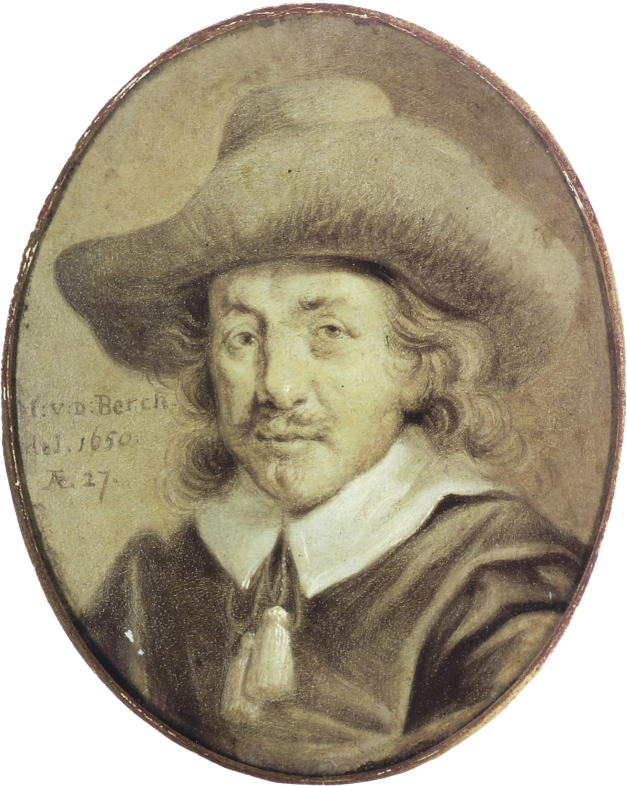
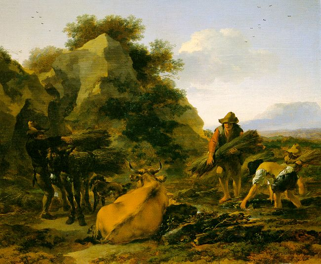
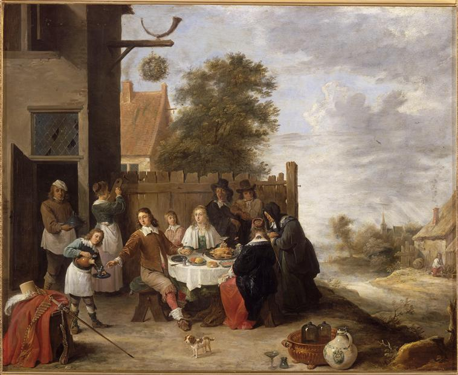

```{r setup, include=FALSE}
knitr::opts_chunk$set(echo = FALSE)
suppressWarnings(library(knitr)) 
suppressWarnings(library(dplyr))
suppressWarnings(library(ggplot2))
suppressWarnings(library(GGally))
suppressWarnings(library(mice))
suppressWarnings(library(purrr))
suppressWarnings(library(glmnet))
suppressWarnings(library(MASS))
suppressWarnings(library(BAS))
suppressWarnings(library(tidyselect))
suppressWarnings(library(stringr))
```

```{r read-data, echo=FALSE}
set.seed(10)
load("paintings_train.Rdata")
load("paintings_test.Rdata")
```

```{r, echo=FALSE, message=FALSE, warning=FALSE}
## Remove Intuitively Useless Variables
 paintings_train_1 = paintings_train %>% 
   dplyr::select(-sale,
                 -count,
                 -price,
                 -authorstandard,
                 -winningbidder,
                 -other,
                 -Height_in,
                 -Width_in,
                 -Surface_Rect,
                 -Diam_in,
                 -Surface_Rnd,
                 -material,
                 -mat,
                 -lands_sc,
                 -lands_elem,
                 -lands_figs,
                 -lands_ment,
                 -lot,
                 -winningbiddertype,
                 -type_intermed) %>% 
   mutate(
     subject = ifelse(str_detect(paintings_train$subject,"Paysages|paysages|Paysage|paysage"), "Paysage",
           ifelse(str_detect(paintings_train$subject,"Saint|Saints|saint|saints|Notre Seigneur|NS|Notre-Seigneur|N.S.|JC|J.C.|Jesus-Christ|Jesus Christ|Assomption|Vierge|vierge|Vierges|vierges|martyre|Martyre"), "Saint",
           ifelse(str_detect(paintings_train$subject,"Portrait|Portraits|portrait|portraits"), "Portrait",
           ifelse(str_detect(paintings_train$subject,"Marine|marine|Marines|marines"), "Marine",
           ifelse(str_detect(paintings_train$subject,"Bustes|bustes|Buste|buste"), "Buste", 
           ifelse(str_detect(paintings_train$subject,"Fruits|fruits|Fruit|fruit|Fleurs|flures|Fleur|fleur|feuille|Feuille|feuilles|Feuilles"), "Fruit$Flower", 
           ifelse(str_detect(paintings_train$subject,"Sujets|sujets|Sujet|sujet"), "Sujet", 
           ifelse(str_detect(paintings_train$subject,"Hommes|Homme|hommes|homme|L'Homme|Femmes|Femme|femmes|femme|Cavaliers|cavaliers|Cavalier|cavalier|Enfants|enfants|Enfant|enfant|L'Enfant|L'enfant|Mariage|mariage|Dame|Dames|dame|dames|Marchande|Marchand|marchand|marchande|Officier|Officiers|officier|officiers"), "People",
           ifelse(str_detect(paintings_train$subject,"Arch|Architecture|Architectures|architecture|architectures|interieur|Interieur|L'interieur|L'Interieur"), "Arch", 
           ifelse(str_detect(paintings_train$subject,"bataille|Bataille|batailles|Batailles|Combat"), "Battle",
           ifelse(str_detect(paintings_train$subject,"Adoration|adoration|Adorations|adoration|L'Adoration|L'adoration|Amour|L'Amour|L'amour"), "Adoration", "other"))))))))))) %>% as.factor(.),
    

     author = ifelse(str_detect(paintings_train$author,
                                "David Teniers|David Tesniers|David T\x8eniers"), "David Teniers", 
          ifelse(str_detect(paintings_train$author,
                            "Francois Boucher|Fran\x8dois Boucher|F. Boucher"), "Francois Boucher", 
          ifelse(str_detect(paintings_train$author,
                            "Philippe Wouvermans|Philippe Wouwermans|d'apr\x8fs P. Wouvermans|Ph. Vouvermans|Philippe Wouermans|Philippe Wouwerman"), "Philippe Wouvermans",
          ifelse(str_detect(paintings_train$author,
                            "Charles de la Fosse|Ch. De la Fosse| Charles de LaFosse|C. la Fosse"), "Charles de la Fosse",
          ifelse(str_detect(paintings_train$author,"French"), "French",
          ifelse(str_detect(paintings_train$author,"Gasparo Van Vitelle"), "Gasparo Van Vitelle",
          ifelse(str_detect(paintings_train$author,"Rosalba Carriera"), "Rosalba Carriera", 
          ifelse(str_detect(paintings_train$author,"Nicolas Poussin|N. Poussin"), "Nicolas Poussin",
          ifelse(str_detect(paintings_train$author,"Gaspard Netscher|G. Netscher"), "Gaspard Netscher",
          ifelse(str_detect(paintings_train$author,"Nicolas Berghem|N. Berghem"), "Nicolas Berghem", "other")))))))))) %>% as.factor(.),
     
     #authorlevel = as.factor(authorlevel),
     #price = as.integer(price),
     dealer = as.factor(dealer),
     origin_author = as.factor(origin_author),
     origin_cat = as.factor(origin_cat),
     school_pntg = ifelse(school_pntg %in% c("A", "X"), "X", school_pntg) %>% as.factor(.),
     authorstyle = ifelse(authorstyle %in% c("n/a", ""), 0, 1) %>% as.factor(),
     #winningbiddertype = ifelse(winningbiddertype %in% c("n/a", ""), "X", winningbiddertype) %>% as.factor(),
     endbuyer = ifelse(endbuyer %in% c("n/a", ""), "X", endbuyer) %>% as.factor(),
     materialCat = ifelse(materialCat %in% c("n/a", ""), "other", materialCat) %>% as.factor(),
     Shape = ifelse(Shape %in% c("round", "roude"), "round",
                    ifelse(Shape %in% c("oval", "ovale"), "oval",
                           ifelse(Shape == "squ_rect", "squ_rect", "other"))) %>% as.factor(),
     artistliving = as.factor(artistliving),
     diff_origin = as.factor(diff_origin),
     engraved = as.factor(engraved),
     original = as.factor(original),
     prevcoll = as.factor(prevcoll),
     othartist = as.factor(othartist),
     paired = as.factor(paired),
     figures = as.factor(figures),
     lrgfont = as.factor(lrgfont),
     relig = as.factor(relig),
     landsALL = as.factor(landsALL),
     arch = as.factor(arch),
     mytho = as.factor(mytho),
     peasant = as.factor(peasant),
     othgenre = as.factor(othgenre),
     singlefig = as.factor(singlefig),
     portrait = as.factor(portrait),
     still_life = as.factor(still_life),
     discauth = as.factor(discauth),
     history = as.factor(history),
     allegory = as.factor(allegory),
     pastorale = as.factor(pastorale),
     finished = as.factor(finished)
   ) %>%  
   .[,c(8, 1:7, 9:39)]

```

```{r message=FALSE, warning=FALSE, echo=FALSE}
micetest = mice::mice(paintings_train_1, printFlag = FALSE)
paintings_train_2 = mice::complete(micetest) %>% 
  mutate(Interm = as.factor(Interm))
```


## EDA & Data Cleaning
```{r parse_df, message=FALSE, warning=FALSE, echo=FALSE}
graph_numeric = paintings_train_2 %>% 
  dplyr::select(position,
         year,
         Surface,
         nfigures)

graph_categorical = paintings_train_2 %>% 
  dplyr::select(-position,
         -year,
         -Surface,
         -nfigures,
         -logprice)
```

- Removed variables:  `lot`, `sale`, `price`, `count`, `subject`, `authorstandard`, `winningbidder`, `Surface_Rnd`, `Surface_Rect`, `material`, `mat`

- Recoded many categorical variables, for example: 
  a. `endbuyer`: "n/a" & "" -- "X"
  b. `authorstyle`: "n/a" & "" -- 0; others: 1
  c. `materialCat`: "n/a" & "" -- "other"
  
```{r cat_eda, echo=FALSE}
## categorical
par(mfrow = c(2,3))
for (i in 1:3){
  boxplot(paintings_train_2$logprice ~ graph_categorical[,i],
          ylab = "logprice",
          xlab = names(graph_categorical)[i])
}

```


## BMA + AIC
```{r}
author = paintings_train_2 %>% 
  group_by(author) %>% 
  summarise(sum = n()) %>% 
  arrange(desc(sum))

kable(author[2:4,])

subject = paintings_train_2 %>% 
  group_by(subject) %>% 
  summarise(sum = n()) %>% 
  arrange(desc(sum))

kable(subject[2:4, ])
```

- BMA: used BPM in BMA to choose base variables that have higher posterior density and good for prediction.
- AIC: generated all possible interactions and applied AIC to choose important features.
- Final model: 19 base vairables; 24 interactions;


## Important Features
```{r slide3, message=FALSE, warning=FALSE}
set.seed(10)
load("paintings_train.Rdata")

 paintings_train_1 = paintings_train %>% 
   dplyr::select(-sale,
                 -count,
                 -price,
                 -authorstandard,
                 -winningbidder,
                 -other,
                 -Height_in,
                 -Width_in,
                 -Surface_Rect,
                 -Diam_in,
                 -Surface_Rnd,
                 -material,
                 -mat,
                 -lands_sc,
                 -lands_elem,
                 -lands_figs,
                 -lands_ment,
                 -lot,
                 -winningbiddertype,
                 -type_intermed) %>% 
   mutate(
     subject = ifelse(str_detect(paintings_train$subject,"Paysages|paysages|Paysage|paysage"), "Paysage",
           ifelse(str_detect(paintings_train$subject,"Saint|Saints|saint|saints|Notre Seigneur|NS|Notre-Seigneur|N.S.|JC|J.C.|Jesus-Christ|Jesus Christ|Assomption|Vierge|vierge|Vierges|vierges|martyre|Martyre"), "Saint",
           ifelse(str_detect(paintings_train$subject,"Portrait|Portraits|portrait|portraits"), "Portrait",
           ifelse(str_detect(paintings_train$subject,"Marine|marine|Marines|marines"), "Marine",
           ifelse(str_detect(paintings_train$subject,"Bustes|bustes|Buste|buste"), "Buste", 
           ifelse(str_detect(paintings_train$subject,"Fruits|fruits|Fruit|fruit|Fleurs|flures|Fleur|fleur|feuille|Feuille|feuilles|Feuilles"), "Fruit$Flower", 
           ifelse(str_detect(paintings_train$subject,"Sujets|sujets|Sujet|sujet"), "Sujet", 
           ifelse(str_detect(paintings_train$subject,"Hommes|Homme|hommes|homme|L'Homme|Femmes|Femme|femmes|femme|Cavaliers|cavaliers|Cavalier|cavalier|Enfants|enfants|Enfant|enfant|L'Enfant|L'enfant|Mariage|mariage|Dame|Dames|dame|dames|Marchande|Marchand|marchand|marchande|Officier|Officiers|officier|officiers"), "People",
           ifelse(str_detect(paintings_train$subject,"Arch|Architecture|Architectures|architecture|architectures|interieur|Interieur|L'interieur|L'Interieur"), "Arch", 
           ifelse(str_detect(paintings_train$subject,"bataille|Bataille|batailles|Batailles|Combat"), "Battle",
           ifelse(str_detect(paintings_train$subject,"Adoration|adoration|Adorations|adoration|L'Adoration|L'adoration|Amour|L'Amour|L'amour"), "Adoration", "other"))))))))))) %>% as.factor(.),
    

     author = ifelse(str_detect(paintings_train$author,
                                "David Teniers|David Tesniers|David T\x8eniers"), "David Teniers", 
          ifelse(str_detect(paintings_train$author,
                            "Francois Boucher|Fran\x8dois Boucher|F. Boucher"), "Francois Boucher", 
          ifelse(str_detect(paintings_train$author,
                            "Philippe Wouvermans|Philippe Wouwermans|d'apr\x8fs P. Wouvermans|Ph. Vouvermans|Philippe Wouermans|Philippe Wouwerman"), "Philippe Wouvermans",
          ifelse(str_detect(paintings_train$author,
                            "Charles de la Fosse|Ch. De la Fosse| Charles de LaFosse|C. la Fosse"), "Charles de la Fosse",
          ifelse(str_detect(paintings_train$author,"French"), "French",
          ifelse(str_detect(paintings_train$author,"Gasparo Van Vitelle"), "Gasparo Van Vitelle",
          ifelse(str_detect(paintings_train$author,"Rosalba Carriera"), "Rosalba Carriera", 
          ifelse(str_detect(paintings_train$author,"Nicolas Poussin|N. Poussin"), "Nicolas Poussin",
          ifelse(str_detect(paintings_train$author,"Gaspard Netscher|G. Netscher"), "Gaspard Netscher",
          ifelse(str_detect(paintings_train$author,"Nicolas Berghem|N. Berghem"), "Nicolas Berghem", "other")))))))))) %>% as.factor(.),
     
     #authorlevel = as.factor(authorlevel),
     #price = as.integer(price),
     dealer = as.factor(dealer),
     origin_author = as.factor(origin_author),
     origin_cat = as.factor(origin_cat),
     school_pntg = ifelse(school_pntg %in% c("A", "X"), "X", school_pntg) %>% as.factor(.),
     authorstyle = ifelse(authorstyle %in% c("n/a", ""), 0, 1) %>% as.factor(),
     #winningbiddertype = ifelse(winningbiddertype %in% c("n/a", ""), "X", winningbiddertype) %>% as.factor(),
     endbuyer = ifelse(endbuyer %in% c("n/a", ""), "X", endbuyer) %>% as.factor(),
     materialCat = ifelse(materialCat %in% c("n/a", ""), "other", materialCat) %>% as.factor(),
     Shape = ifelse(Shape %in% c("round", "roude"), "round",
                    ifelse(Shape %in% c("oval", "ovale"), "oval",
                           ifelse(Shape == "squ_rect", "squ_rect", "other"))) %>% as.factor(),
     artistliving = as.factor(artistliving),
     diff_origin = as.factor(diff_origin),
     engraved = as.factor(engraved),
     original = as.factor(original),
     prevcoll = as.factor(prevcoll),
     othartist = as.factor(othartist),
     paired = as.factor(paired),
     figures = as.factor(figures),
     lrgfont = as.factor(lrgfont),
     relig = as.factor(relig),
     landsALL = as.factor(landsALL),
     arch = as.factor(arch),
     mytho = as.factor(mytho),
     peasant = as.factor(peasant),
     othgenre = as.factor(othgenre),
     singlefig = as.factor(singlefig),
     portrait = as.factor(portrait),
     still_life = as.factor(still_life),
     discauth = as.factor(discauth),
     history = as.factor(history),
     allegory = as.factor(allegory),
     pastorale = as.factor(pastorale),
     finished = as.factor(finished)
   ) %>%  
   .[,c(8, 1:7, 9:39)]
 
micetest = mice::mice(paintings_train_1, printFlag = FALSE)
paintings_train_2 = mice::complete(micetest) %>% 
  mutate(Interm = as.factor(Interm))

ols.2 = lm(logprice ~ Shape + school_pntg +
           dealer*Interm + dealer*paired + dealer*artistliving + dealer*diff_origin +
           artistliving*endbuyer + artistliving*finished + artistliving*year +
           diff_origin*Surface + diff_origin*portrait  + diff_origin*still_life + diff_origin*prevcoll +
           endbuyer*Surface + endbuyer*paired + endbuyer*year +
           authorstyle*portrait +
           Interm*lrgfont +
           paired*lrgfont + paired*subject + paired*discauth + paired*author +
           finished*discauth +
           lrgfont*discauth +
           prevcoll*dealer + prevcoll*Interm,
           data = paintings_train_2)

ols.2.ci =  confint(ols.2)
coef_table = data.frame(names = rownames(ols.2.ci), 
                        coef = coef(ols.2), 
                        lower = ols.2.ci[,1], 
                        upper = ols.2.ci[,2])[-1,] %>%
            filter(!(upper>0 & lower<0)) %>%
            arrange(desc(abs(coef)))

# barplot(coef_table[2:11,2], names.arg = coef_table[2:11,1], 
#         cex.names = 0.8, cex.lab = 0.8,
#         horiz = TRUE, las = 1)


ggplot2::ggplot(data = coef_table[2:10,], mapping = ggplot2::aes(x = names, y = coef)) + 
  ggplot2::geom_bar(stat = "identity") +
  coord_flip() +
  xlab("value") +
  ylab("covariate") + 
  ggtitle("Important Covariates")


```


## Model Diagnostics

```{r slide4, warning=FALSE, message=FALSE}
par(mfrow = c(2,2))
plot(ols.2)

```

## Interesting Finding
- The most expensive five paintings predicted from the validation set all come from the same artist: Nicolaes Pieterszoon Berchem;
- Most of the more expensive paintings are auctioned from the dealer with initial "R";
- The endbuyer of these expensive paintings are, instead of a buyer or a dealer who may serve as an intermediary, collectors themselves;
- Extremely large surface are doesn't mean high price;
- This painting is an example of highly priced paintings:

1. https://upload.wikimedia.org/wikipedia/commons/e/e0/David_Teniers_the_Younger_-_The_Feast_of_the_Prodigal_Son.jpg)
2. https://upload.wikimedia.org/wikipedia/commons/e/e8/Berchem%2C_Nicolaes_~_Landscape_with_Herdsmen_Gathering_Sticks%2C_early_1650s%2C_oil_on_panel%2C_private_collection%2C_New_York.jpg

## Artist


## Painting 1


Citation: 

1. https://en.wikipedia.org/wiki/Nicolaes_Pieterszoon_Berchem#/media/File:Portrait_of_Nicolaes_Berchem_by_Jan_Stolker.jpg

## Painting 2


